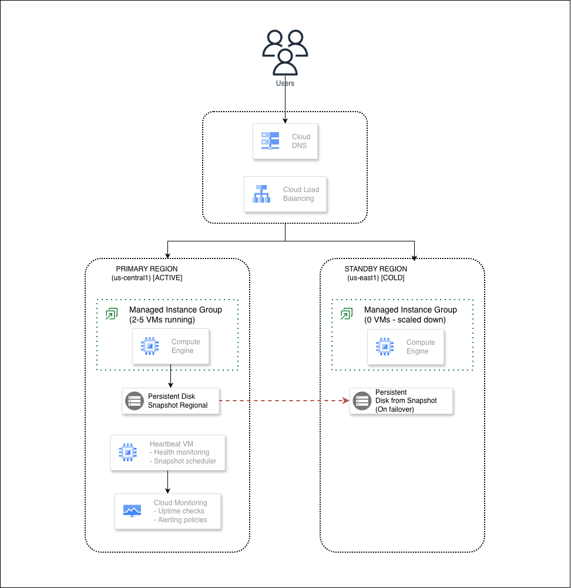

# GCP Disaster Recovery: Cold Standby Architecture

A production-ready hands-on lab demonstrating **Cold Standby Disaster Recovery** on Google Cloud Platform. This lab covers automated backup, snapshot management, and failover mechanisms using Cloud DNS, Load Balancing, Managed Instance Groups, and Persistent Disk Snapshots.

## Architecture Overview



## Prerequisites

- Google Cloud Platform account with billing enabled
- `gcloud` CLI installed and configured
- Terraform >= 1.5.0
- Owner or Editor role on the GCP project

## Repository Structure

```
gcp-dr-cold-standby/
├── README.md
├── TROUBLESHOOTING.md
├── terraform/
│   ├── main.tf
│   ├── variables.tf
│   ├── outputs.tf
│   ├── versions.tf
│   ├── terraform.tfvars.example
│   └── modules/
│       ├── networking/
│       ├── compute/
│       ├── load-balancing/
│       ├── dns/
│       ├── snapshot/
│       ├── heartbeat/
│       └── monitoring/
├── scripts/
│   ├── setup.sh
│   ├── deploy.sh
│   ├── failover.sh
│   ├── failback.sh
│   ├── test-failover.sh
│   └── cleanup.sh
├── app/
│   ├── Dockerfile
│   ├── main.py
│   ├── requirements.txt
│   └── startup-script.sh
└── docs/
    ├── ARCHITECTURE.md
    └── RUNBOOK.md
```

## Quick Start

### 1. Clone and Setup

```bash
git clone https://github.com/misskecupbung/gcp-dr-cold-standby.git
cd gcp-dr-cold-standby

# Run setup (auto-detects project, email, and configures terraform.tfvars)
./scripts/setup.sh
```

### 2. Deploy Infrastructure

```bash
./scripts/deploy.sh

# Or manually:
cd terraform
terraform init
terraform plan
terraform apply
```

### 3. Verify Deployment

```bash
./scripts/verify-deployment.sh
curl http://$(terraform output -raw load_balancer_ip)/health
```

## Key Components

### 1. Global HTTP(S) Load Balancer
- Single anycast IP for global access
- Backend services in both regions
- Health checks with auto-healing

### 2. Managed Instance Groups
- **Primary Region**: 2-5 active instances with autoscaling
- **Standby Region**: 0 instances (cold standby)

### 3. Heartbeat and Snapshot System
- Dedicated VM for health monitoring
- Scheduled PD snapshots (hourly)
- Automated alerts on failure

### 4. Persistent Disk Snapshots
- Scheduled snapshot policies
- Multi-regional storage for DR

## DR Testing

### Manual Failover

```bash
./scripts/failover.sh
./scripts/failback.sh
```

### Automated DR Test

```bash
./scripts/test-failover.sh --simulate-failure
```

### Verification Commands

```bash
# Check primary MIG instances
gcloud compute instance-groups managed list-instances \
  $(terraform output -raw primary_mig_name) \
  --region=us-central1

# Check standby MIG instances  
gcloud compute instance-groups managed list-instances \
  $(terraform output -raw standby_mig_name) \
  --region=us-east1

# List snapshots
gcloud compute snapshots list --filter="labels.purpose=dr-cold-standby"

# Check heartbeat instance
gcloud compute instances describe $(terraform output -raw heartbeat_instance_name) \
  --zone=us-central1-a --format="table(name,status)"
```

## Recovery Objectives

| Metric | Target |
|--------|--------|
| **RPO** (Recovery Point Objective) | ~1 hour (snapshot interval) |
| **RTO** (Recovery Time Objective) | ~10-15 min (cold start) |

## Optional: Enable DNS

DNS is disabled by default. If you have a domain, you can enable it after deployment:

```bash
# 1. Edit terraform.tfvars
vim terraform/terraform.tfvars
```

Update these values:
```hcl
enable_dns    = true
dns_zone_name = "dr-zone"
domain_name   = "dr.yourdomain.com."  # Must end with dot
```

```bash
# 2. Apply changes
cd terraform
terraform apply

# 3. Get the nameservers
terraform output dns_name_servers

# 4. Update your domain registrar with those nameservers

# 5. Test after DNS propagation (5-60 min)
curl http://dr.yourdomain.com/health
```

## Additional Resources

- [GCP Disaster Recovery Planning Guide](https://cloud.google.com/architecture/dr-scenarios-planning-guide)
- [Compute Engine Snapshots Best Practices](https://cloud.google.com/compute/docs/disks/snapshots)
- [Cloud DNS Routing Policies](https://cloud.google.com/dns/docs/routing-policies)
- [Global Load Balancing Overview](https://cloud.google.com/load-balancing/docs/https)

## License

This project is licensed under the MIT License - see the [LICENSE](LICENSE) file for details.
